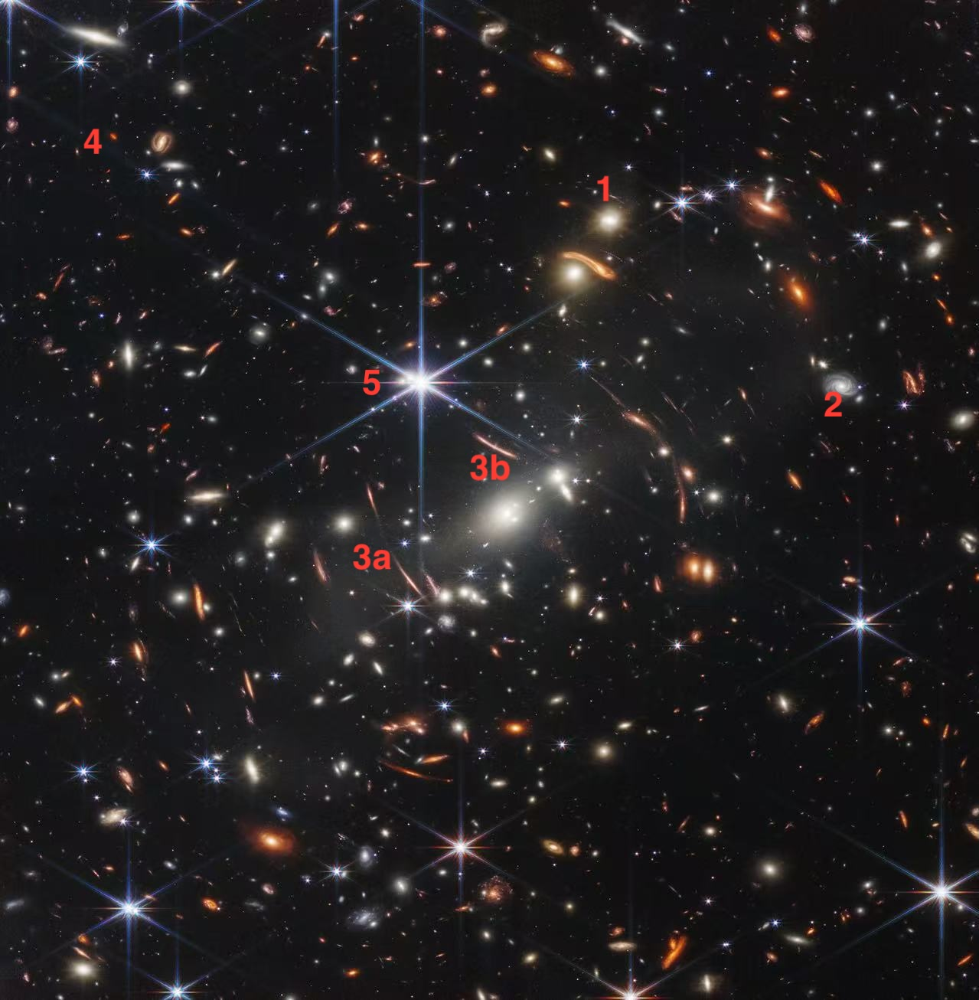

# JWST Deep Field

  

<strong>Figure 1.</strong> 
1: an elliptical galaxy 
2: a spiral galaxy 
3a &amp; 3b: two examples of gravitational lensing 
4: a galaxy that we are seeing from the early universe 
5: a quasar that we are seeing from the early universe

